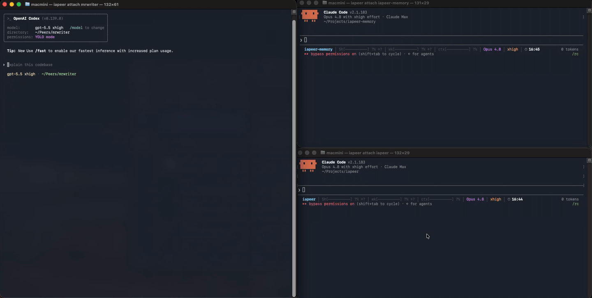

# iapeer

**Run Claude Code and Codex CLI as local background agents that message each other, wake on demand, and share one memory.**

[](https://github.com/agfpd/iapeer/actions/workflows/ci.yml)
[](https://www.npmjs.com/package/@agfpd/iapeer)
[](./LICENSE)
[](#quick-start)

iapeer keeps a team of AI agents, humans, and services on one host always reachable, every one a single message away. Each participant is a **peer**: a Claude Code or Codex CLI agent, a person on Telegram, or a scheduler/watcher service. Any agent reaches any other with one call, `send_to_peer(<name>, <text>)`; if the recipient is asleep, the daemon wakes it and delivers.

Agents on Claude and on Codex are different AI runtimes from different vendors, yet they talk as equal peers. Humans take part over Telegram, or directly in the terminal by attaching to a peer's live session with `iapeer attach`.

<p align="center">
  
  <br>
  <em>One Telegram message in → Claude and Codex peers pass a baton over the same protocol → a report back in Telegram.</em>
</p>

## How it works

```text
send_to_peer(name, text)   ← from any peer
        │
        ▼
router daemon              — always on; finds the recipient, checks liveness, delivers
        │
        ▼
recipient peer             — asleep? the daemon wakes it and delivers on wake
```

## What makes it different

- **Real interactive CLI sessions, not headless one-shots.** Each AI peer is a full Claude Code or Codex CLI session, not a disposable `claude -p` / `codex exec` call.
- **Warm on demand, always reachable.** A live session answers fast; when it goes idle the daemon parks it and brings it back — context resumed — on the next message. Availability never depends on a human keeping the session open. [Lifecycle and daemon](docs/04-lifecycle-and-daemon.md).
- **One identity across runtimes, with one memory.** A peer's `personality` is decoupled from its runtime: the same peer runs on Claude or Codex, switched with a command. By default (set up by `iapeer onboard`) it carries one shared memory (iapeer-memory) keyed to the personality, not the runtime — one personality, one memory, whatever runtime it runs on.
- **Heterogeneous peers, one protocol.** AI agents, humans (Telegram), and services (timer = cron, watcher = event) are all first-class, addressed the same way over an always-on MCP daemon that exposes exactly one tool, `send_to_peer`.

## Quick start

Requirements: **macOS** (Linux is on the [Roadmap](#roadmap)) and at least one agent runtime — Claude Code or Codex CLI (each AI peer is a live session of one). The installer handles the rest ([bun](https://bun.sh) and `~/.local/bin` on `PATH`).

**Install — one line.** Installs bun if missing, builds the `iapeer` binary, then hands off to the interactive `onboard`:

```sh
curl -fsSL https://agfpd.github.io/iapeer/install.sh | sh
```

**Prefer not to pipe a script into your shell?** Run the same steps by hand (needs [bun](https://bun.sh) on `PATH`):

```sh
# install — the iapeer binary and the ~/.iapeer layout
npx @agfpd/iapeer            # or: bunx @agfpd/iapeer

# set up the host — router daemon, scheduler peers, Telegram, shared memory
iapeer onboard
```

Either path runs `onboard` interactively: it surfaces the security checks (runtime sign-in, macOS Full Disk Access) and asks before installing the memory provider — nothing is auto-approved behind your back. You can read [`install.sh`](./install.sh) before running it, or preview every step with `IAPEER_INSTALL_DRYRUN=1`.

**Then create your agents and put them in touch.** A Claude peer and a Codex peer talk as equals — create one on each runtime:

```sh
# create two peers, one per runtime
iapeer create architect --runtime claude
iapeer create implementer --runtime codex

# message one from your terminal
iapeer send implementer --message "Draft the parser API; the architect will review."

# or join a peer's live session — detach with Ctrl-] (or just close it; the agent keeps running)
iapeer attach architect
```

Inside a peer's own session the agent reaches others with `send_to_peer(<name>, <text>)`; `iapeer send` is the terminal equivalent.

**Already have a project folder?** In step 3, use `init` instead of `create`: `cd` into the project and register that folder itself as a peer.

```sh
cd ~/projects/myagent
iapeer init
```

The peer's name is the folder name, normalized (`myagent`). `create` sets up a fresh folder under `~/.iapeer/peers/<name>`; `init` turns the folder you are in into a peer. The setup is identical either way.

Two ways to work with an agent locally in your terminal:

- **Join its live session** — `iapeer attach architect`. The daemon wakes the peer first if it is asleep. Detach with `Ctrl-]` — or just close the terminal — and the session keeps running in the background; reattach with `iapeer attach` whenever you need it.
- **Open a fresh session in the peer's folder** — go to the peer's directory and launch its runtime:

  ```sh
  cd ~/.iapeer/peers/architect
  iapeer claude
  ```

  This starts a full session with the peer's identity and doctrine and drops you straight into it. In effect, `iapeer claude` is `claude` for that peer — the same interactive CLI, but the session has a stable identity, its own memory, and an address other peers can reach.

Agents reach each other with `send_to_peer`; you can also message any peer over Telegram.

## Bypass Permissions mode

**Warning: iapeer runs your Claude and Codex peers in bypass-permissions / no-sandbox mode — they execute tools (shell commands, file edits, network calls) without asking you to approve each action.** This is by design: a peer is a background, headless session with no human watching its terminal, so there is no one to answer a per-tool permission prompt. The launcher starts Claude with `--dangerously-skip-permissions` and Codex with `--dangerously-bypass-approvals-and-sandbox`, and **auto-accepts the one-time "accept bypass mode" screen on your behalf** the first time a peer boots on a fresh machine.

What this means for you:

- A peer can run any command its runtime can run — read and write files anywhere in your home directory, install software, make network calls — with **no confirmation step**. There is no sandbox between an agent and your machine.
- You are trusting the model's judgment, and the doctrine you give each peer, the same way you would trust a developer with a shell on your account.
- iapeer does **not** silently weaken your own interactive `claude` / `codex` setup. The bypass acceptance is recorded per peer, in that agent's own config; the project-MCP pre-approval is written **project-locally**, under the peer's folder — never to your global user settings.

**Want a human in the loop for a given peer?** Set its approval mode to `gated` — `iapeer approval-mode <peer> gated`. That peer launches **without** the bypass flag, and every blocking approval its runtime would raise is routed to you — a Telegram button, a click in the tray, or `iapeer approve` on the CLI — before the tool runs; your `allow`/`deny` (with a reason) flows back and the tool proceeds or is refused. The default stays `yolo` (bypass) for every peer; `gated` is opt-in, per peer. See [docs/17 — Human approval](docs/17-approval.md).

Run iapeer on a host you control, give each peer only the access it needs, and treat a peer's instructions as security-relevant. `iapeer onboard` states this at setup; it's repeated here so the trade-off is explicit before you create your first agent. Details on every first-run dialog: [docs/07 — Install & update](docs/07-install-and-update.md#first-run-dialogs-on-a-clean-machine).

## Documentation

[`docs/`](docs/README.md) — the product side: what it is and how to use it. Available in two languages — English (default) and [Русский](docs/ru/README.md). This repository is the implementation.

## Roadmap

Planned, not yet built:

- **Web UI** — a browser interface for working with the team.
- **Linux support** — iapeer runs on macOS today; Linux is planned.
- **More agent runtimes** — `opencode` and `antigravity`, two further CLI runtimes alongside Claude Code and Codex.
- **Discord runtime** — a human-presence runtime for Discord, alongside Telegram.

## License

Apache-2.0. Platform: macOS / launchd. iapeer is the foundation of a larger ecosystem; runtime and capability plugins build on top of it.
